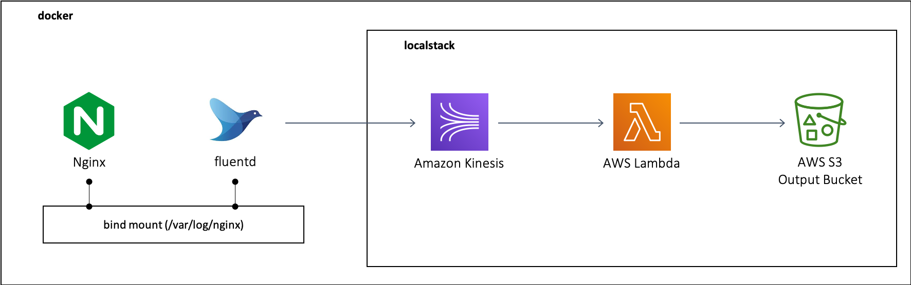

### Centralized Logging Pipeline 

본 문서는 AWS에 배포된 웹서버를 대상으로 하여 중앙화된 로깅 파이프라인을 구축 합니다. 


#### Requirements

macOS Catalina  10.15.4 에서 테스트 되었으며, 아래 환경이 사전 설치 되어 있어야 합니다.

* docker & docker-compose 
* localstack 
* awscli-local 


#### 환경구성

본 테스트는 모두 docker 환경에서 동작 합니다. 



docker-compose.yml 을 통해 생성되는 이미지는 web(nginx), fluentd, localstack 3개의 이미지 이며, 각 설명은 다음과 같습니다. 

nginx는 nginx 기본 패키지만 설치 되어 있는 이미지로, localhost의 ./nginx/log 디렉토리를 nginx 로그 영역인 /var/log/nginx에 마운트 합니다. 

Fluetnd 는 fluent-plugin-kinesis plugin을 설치하는 이미지 입니다. nginx와 함께 마운트하는 log 디렉토리를 tail 하여 kinesis stream 에 전달 합니다. fluent에 대한 설정은 fluentd/conf/fluent.conf 에 위치 합니다. 

localstack은 kinesis, lambda, s3, iam 서비스가 로드되며 각 서비스는 다음과 같은 형태로 구성 됩니다. 

* kinesis 
  * nginx-accesslog-stream 의 이름을 갖는 스트림을 생성 합니다. 
  * 해당 스트림에서는 fluentd 로 부터 전달 받은 access.log를 lambda와 연계하여 데이터 처리 합니다. 
* lambda 
  * KinesisAccessLogToS3 라는 function 을 생성합니다. 
  * 해당 function은 kinesis 로 부터 전달 받은 access.log를 json 포맷으로 변환하여 S3 bucket에 저장 합니다. 
  * 해당 lambda function에 대한 스크립트는 init/kinesis_event_to_s3.py 에 위치 합니다. 
* IAM
  * kinesis-lambda-role 이라는 신규 role 을 생성합니다. 
  * 위 role 은 KinesisAccessLogToS3 function에 적용되는 role 로 kinesis 및 S3 에 대한 권한을 보유 합니다. 
* S3
  * nginx-accesslog 라는 bucket 을 생성 합니다. 
  * 해당 bucket 에 lambda를 통해 json 형식으로 변환된 로그 파일이 저장되며 파일은 다음과 같은 형태로 저장 됩니다. YYYY/MM/DD/HH/nginx_access_log_mmss.jon 

위 localstack 에서 생성되는 리소스들은 init 디렉토리에 있는 init_resource.py 파일의 실행을 통해 각각 생성 됩니다. 


#### 실행 

centralized-logging-pipeline.zip 파일 다운로드 한 후 아래 명령어 실행 

```
$ unzip centralized-logging-pipeline.zip 
$ cd centralized-logging-pipeline
$ sh start.sh 
$ cd init

# localstack 서비스들이 정상 구동된 이후(http://localhost:4566) 아래 스크립트 실행 
$ python3 init_resource.py 
```

docker-compose 를 통해 이미지 빌드 및 nginx, fluentd, localstack 실행 

init_resource.py 를 실행하여 테스트 환경에 필요한 리소스들(kinesis stream, s3 bucket, role, labmda)을 localstack에 생성 


#### Proof of concept 

localhost의 브라우저를 통해  해당 페이지 접근 

http://localhost 


nginx access.log 에 해당 파일이 S3 버킷(nginx-accesslog) 에 생성되는지 확인 및 object 파일을 다운로드 하여 로그 내용 확인 

``` ld
$ awslocal s3 ls nginx-accesslog --recursive  
2020-05-27 20:54:19       4189 2020/05/27/11/nginx_access_log_5419.json
2020-05-27 21:05:40       4455 2020/05/27/12/nginx_access_log_0540.json

$ aws --endpoint-url http://localhost:4566 s3api get-object --bucket nginx-accesslog --key 2020/05/27/12/nginx_access_log_0540.json  mydata.out

$ cat mydata.out 
{"remoteaddr": "172.22.0.1", "remoteuser": "-", "timelocal": "27/May/2020:08:23:31 +0000", "method": "GET", "url": "/ ", "statuscode": "304", "bytessent": "0", "refferer": "-", "useragent": "Mozilla/5.0 (Macintosh; Intel Mac OS X 10_15_4) AppleWebKit/537.36 (KHTML, like Gecko) Chrome/83.0.4103.61 Safari/537.36\" \"-"}
{"remoteaddr": "172.22.0.1", "remoteuser": "-", "timelocal": "27/May/2020:08:23:32 +0000", "method": "GET", "url": "/ ", "statuscode": "304", "bytessent": "0", "refferer": "-", "useragent": "Mozilla/5.0 (Macintosh; Intel Mac OS X 10_15_4) AppleWebKit/537.36 (KHTML, like Gecko) Chrome/83.0.4103.61 Safari/537.36\" \"-"}
{"remoteaddr": "172.22.0.1", "remoteuser": "-", "timelocal": "27/May/2020:08:23:35 +0000", "method": "GET", "url": "/ ", "statuscode": "304", "bytessent": "0", "refferer": "-", "useragent": "Mozilla/5.0 (Windows NT 10.0; Win64; x64) AppleWebKit/537.36 (KHTML, like Gecko) Chrome/81.0.4044.138 Safari/537.36\" \"-"}
```


##### 참조 

* docker fluentd 설정 : https://docs.fluentd.org/container-deployment/docker-compose 
* Stream Processing with Kinesis : https://docs.fluentd.org/container-deployment/docker-compose 
* with kinesis example : https://docs.aws.amazon.com/ko_kr/lambda/latest/dg/with-kinesis-example.html 
* Using AWS Lambda with Kinesis : https://docs.aws.amazon.com/ko_kr/lambda/latest/dg/with-kinesis.html 
* kinesis lambda 예제 : https://docs.aws.amazon.com/ko_kr/lambda/latest/dg/with-kinesis-create-package.html#with-kinesis-example-deployment-pkg-python 
* nginx access log parsing : https://gist.github.com/hreeder/f1ffe1408d296ce0591d 
* example amazon s3 function code : https://docs.aws.amazon.com/ko_kr/lambda/latest/dg/with-s3-example-deployment-pkg.html 
* boto3 doc : https://boto3.amazonaws.com/v1/documentation/api/latest/reference/services/s3.html 
* localstack 내부 api 연결시 오류 : https://github.com/localstack/localstack/issues/2421 

끝.